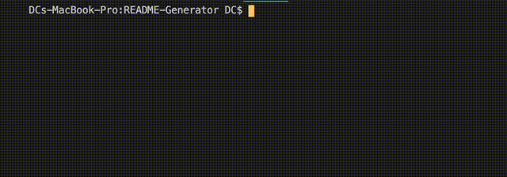

# README Generator

<svg xmlns="http://www.w3.org/2000/svg" xmlns:xlink="http://www.w3.org/1999/xlink" width="96" height="20"><linearGradient id="b" x2="0" y2="100%"><stop offset="0" stop-color="#bbb" stop-opacity=".1"/><stop offset="1" stop-opacity=".1"/></linearGradient><clipPath id="a"><rect width="96" height="20" rx="3" fill="#fff"/></clipPath><g clip-path="url(#a)"><path fill="#555" d="M0 0h79v20H0z"/><path fill="#97ca00" d="M79 0h17v20H79z"/><path fill="url(#b)" d="M0 0h96v20H0z"/></g><g fill="#fff" text-anchor="middle" font-family="DejaVu Sans,Verdana,Geneva,sans-serif" font-size="110"> <text x="405" y="150" fill="#010101" fill-opacity=".3" transform="scale(.1)" textLength="690">Contributors</text><text x="405" y="140" transform="scale(.1)" textLength="690">Contributors</text><text x="865" y="150" fill="#010101" fill-opacity=".3" transform="scale(.1)" textLength="70">1</text><text x="865" y="140" transform="scale(.1)" textLength="70">1</text></g> </svg>

## Description

This project is allows a user to create a README.md from a their input in a command-line application that dynamically generates the file for use in a repository.

## Table of Contents

- [Description](#description)
- [Installation](#installation)
- [Usage](#usage)
- [Authors and Acknowledgment](#authors-and-acknowledgment)
- [License](#license)

## Installation

After installing the dependencies of:
"axios": "^0.19.0",
"dotenv": "^8.0.0",
"gh-badges": "^2.2.1",
"inquirer": "^6.3.1"
by running node index.js the user is prompted for the required information on their README to be created.

## Usage

This application allows for the creation of a README in a templatre that allows for less time in writing and more time doing more important things.

## Authors and Acknowledgment

###Main Author
[DCRevResLabs](https://github.com/DCRevResLabs)

## License

© 2020 Revolution Research Laboratories Pty.Ltd. All Rights Reserved.
